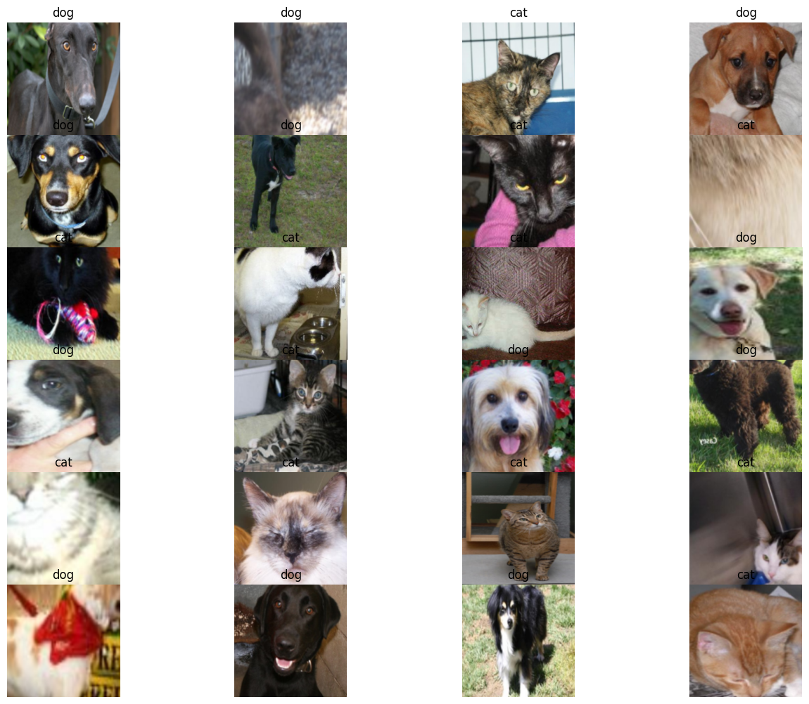
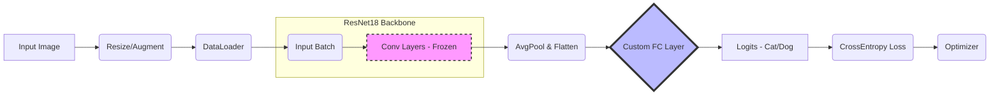

# 🐱🐶 Cat vs Dog Classification using Feature Extraction (PyTorch)
*이 프로젝트는 PyTorch를 사용하여 특성 추출(Feature Extraction) 기법을 실습한 이미지 분류 모델링 코드입니다. 사전 학습된(Pre-trained) 모델을 활용하여 `Cat`과 `Dog` 데이터셋을 효과적으로 분류하는 방법을 다룹니다.*

## 프로젝트 개요
- **목표**: 사전 학습된 모델의 가중치(Weight)를 고정한 상태로, 마지막 분류기(Classifier) 층만 학습시켜 새로운 데이터셋에 적용하는 **특성 추출** 기법 이해 및 구현.
- **데이터셋**: Cat and Dog Dataset (Train/Validation)
- **핵심 기술**:
    - `PyTorch`, `Torchvision`
    - Transfer Learning (Feature Extraction)
    - Data Augmentation (RandomResizedCrop, RandomHorizontalFlip)

## 프로젝트 파이프라인 
**전이 학습(Transfer Learning) 효율을 극대화하기 위해 ResNet18의 합성곱 층(Convolutional Layers)은 고정(Freeze)하고, 마지막 분류기(Classifier)만 학습하는 전략을 사용했습니다.**

## 주요 전처리 (Preprocessing)
**모델의 일반화 성능을 높이기 위해 다음과 같은 데이터 증강(Augmentation)이 적용되었습니다.**

* Resize: 256x256 크기로 리사이즈

* RandomResizedCrop: 224x224 크기로 무작위 크롭

* RandomHorizontalFlip: 수평 뒤집기

* Normalization: 텐서 변환

## Training Results

**ResNet18 Feature Extraction을 통한 학습 안정성 및 성능 검증**

* **Loss 추이 (Stable Convergence)**
    * **Training Loss**가 지속적으로 감소하며 모델이 데이터에 잘 적응하고 있음을 보여줍니다.
    * **Validation Loss** 또한 튀지 않고 낮게 유지되고 있어, 과적합(Overfitting) 없이 일반화 성능이 확보되었습니다.

* **Accuracy 추이 (Pre-trained Effect)**
    * **Validation Accuracy**가 학습 초기부터 매우 높게(약 90% 이상) 시작합니다.
    * 이는 ImageNet으로 사전 학습된 ResNet18의 가중치(Weights)가 이미지의 특징을 이미 효과적으로 추출하고 있음을 시사합니다.

* **Key Observation (Validation > Training)**
    * **현상**: 그래프에서 Validation Accuracy(빨간선)가 Training Accuracy(파란선)보다 높게 유지되는 독특한 패턴이 관측됩니다.
    * **원인 분석**:
        1. **Data Augmentation**: 학습(Train) 데이터에는 `RandomResizedCrop`, `HorizontalFlip` 등 강한 변형을 적용하여 난이도를 높였으나, 검증(Val) 데이터는 원본 비율을 유지(`CenterCrop`)했기 때문에 모델 입장에서 추론이 더 용이했습니다.
        2. **Dropout/Batch Norm**: 학습 모드(`train`)와 평가 모드(`eval`)의 동작 차이로 인해 평가 시 성능이 더 높게 측정되었습니다.

### Pros & Cons (장단점 분석)

| 구분 | 주요 내용 |
| :--- | :--- |
| **장점** | **1. 검증된 성능**: ImageNet Pre-trained 가중치를 사용하여 적은 데이터로도 높은 정확도 달성. **2. 학습 속도**: Backbone을 고정(Freeze)하고 FC Layer만 학습시켜 수렴 속도가 매우 빠름. **3. 일반화 능력**: Augmentation 적용으로 새로운 이미지에 대해서도 견고한 성능 기대. |
| **단점** | **1. 도메인 의존성**: ImageNet(실사 이미지)과 도메인이 많이 다른 데이터(예: 의료, 만화)에서는 성능이 떨어질 수 있음. **2. 미세 조정 한계**: Feature Extraction 방식이므로 Backbone 자체의 특징 추출 능력을 수정할 수는 없음 (필요시 Fine-tuning 전환 필요). |

*이 프로젝트는 딥러닝 학습 기록 및 포트폴리오 용도로 작성되었습니다.*